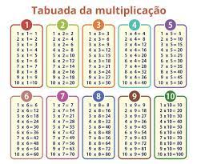

# [Desafio 8] Tabuada

Utilizando a estrutura de repetições , faça um algoritmo que aceite somente números inteiros entre 1 e 10.

Caso o usuário entre com um valor diferente do solicitado , exiba uma mensagem solicitando que o mesmo entre com valores válidos para poder continuar.

Utilizando o número informado pelo usuário , monte uma tabuada e exiba a mesma na tela.