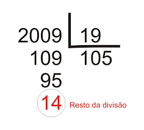

[Desafio 9] Divisão de Valores

Utilizando a estrutura de repetições , construa um algoritmo com as regras abaixo:

O usuário deverá informar **2 valores** para ser realizado o cálculo da divisão.
Se o segundo valor informado for igual a **Zero( 0 )**, então deverá ser solicitado ao usuário que ele entre com um novo valor válido.
Deverá ser exibido na tela o resultado da divisão.