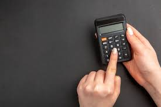

[Desafio 4] Calculadora

Escreva uma calculadora que realize as 4 operações básicas de cálculo (adição, subtração, multiplicação e divisão).

O programa deverá realizar a entradas dos valores para serem realizados os cálculos básicos.

Utilize a condição Switch-Case (Match Case) para realizar a construção do algoritmo.