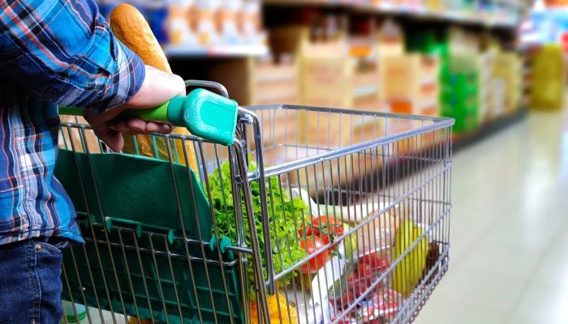

# [Desafio 2] Compras no atacadão

### Descrição do Desafio:

A classe principal deverá ser a CaixaDoAtacado, que terá um método principal computarCompra e deve retonar o valor total levando em consideração as regras de desconto por quantidades conforme anteriorimente e como adicional o método de pagamento (regras abaixo).

Como você irá representar o relacionamento entre as classes fica a cargo da sua interpretação. O ideal é compartilhar e discutir ideias de modelagem com os demais colegas e mentores.

Além do método de pagamento, outra novidade será o input. Este deve ser feito através de uma string que será próxima a um formato csv sem cabeçalho, onde a primeira linha é o metodo de pagamento e cada linha seguinte é um registro em que o primeiro valor é o identificador do item e o segundo a quantidade. Exemplo:

credito
1,2
2,1

Olhando para esse exemplo e olhando nosso cardápio conseguimos identificar que estamos comprando dois cafés e 1 suco.

### Cardápio:

#### ID | Nome | Preço

1 | Café 1kg | 53,00

2 | Sabão em pó | 36,00

3 | Caixa de Leite | 82,00

4 | Refrigerate | 8,50

### Descontos por unidade:

a. Até 5 unidades: valor total

b. De 5 a 15 unidades: 10% de desconto

c. De 15 a 25 unidades: 20% de desconto

d. Acima de 25 unidades: 25% de desconto

### Descontos/acréscimos por método de pagamento:

a. debito - não há descontos

b. dinheiro - 5% de desconto

c. credito - 3% de acréscimo

Bom desafio! :)